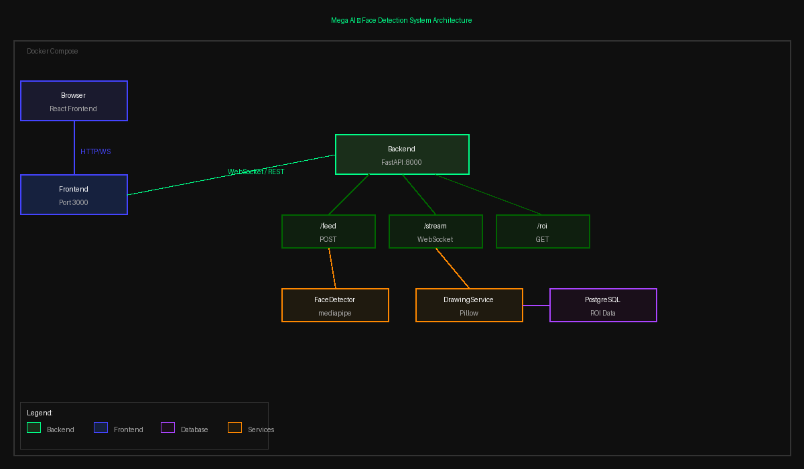

# Face Detection Video Streaming System

Real-time face detection backend that accepts a video feed, detects faces using MediaPipe, draws bounding boxes using Pillow, stores ROI data in PostgreSQL, and streams processed frames back to a React frontend — all containerized with Docker.

## Architecture



## Tech Stack

- **Backend**: Python, FastAPI, WebSockets
- **Face Detection**: MediaPipe (no OpenCV for drawing)
- **Bounding Box Drawing**: Pillow
- **Database**: PostgreSQL + SQLAlchemy
- **Frontend**: React + TypeScript
- **Containerization**: Docker + Docker Compose

## Running in 5 minutes

### Prerequisites
- Docker + Docker Compose installed

### Steps

```bash
git clone <your-repo-url>
cd facedetectionsystem
docker-compose up --build
```

- Frontend: http://localhost:3000
- Backend API docs: http://localhost:8000/docs
- WebSocket stream: ws://localhost:8000/stream

## API Endpoints

| Method | Endpoint | Description |
|--------|----------|-------------|
| POST | `/feed` | Accept a single video frame, detect face, store ROI |
| WS | `/stream` | WebSocket — send frames, receive processed feed + ROI |
| GET | `/roi` | Fetch stored ROI records from database |

## Database Schema

```sql
Table: roi_data
- id           SERIAL PRIMARY KEY
- frame_number INTEGER
- x            FLOAT
- y            FLOAT
- width        FLOAT
- height       FLOAT
- confidence   FLOAT
- created_at   TIMESTAMP
```

## AI Collaboration

Used Claude (Anthropic) as a coding assistant for boilerplate generation, architecture decisions, and code structure. All logic was reviewed, understood, and validated manually. Face detection approach, endpoint design, and database schema were designed collaboratively.

## Project Structure

```
facedetectionsystem/
├── backend/
│   ├── api/
│   │   └── routes.py        # 3 API endpoints
│   ├── services/
│   │   ├── face_detector.py # MediaPipe face detection
│   │   └── drawing.py       # Pillow bounding box drawing
│   ├── db/
│   │   ├── database.py      # SQLAlchemy engine + session
│   │   └── models.py        # ROI table model
│   ├── main.py              # FastAPI app entry point
│   ├── requirements.txt
│   └── Dockerfile
├── frontend/
│   ├── src/
│   │   └── App.tsx          # React webcam + WebSocket client
│   └── Dockerfile
├── docker-compose.yml
├── architecture.png
└── README.md
```